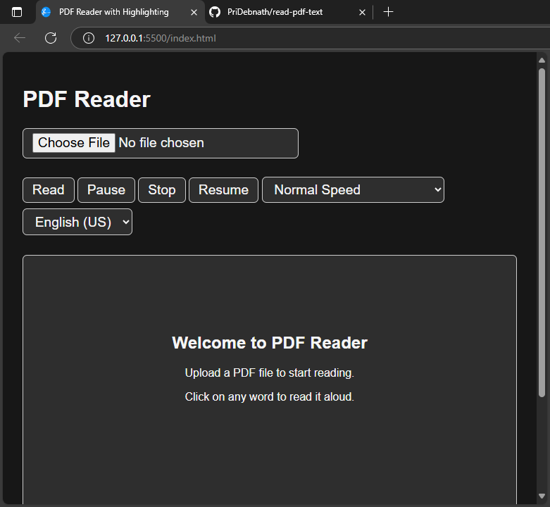

# PDF Reader with Text-to-Speech and Highlighting

This is a simple web-based PDF reader that reads text aloud 
using the Web Speech API and highlights each word as it's spoken. It supports:

## Features

- 📄 Upload any PDF file
- 🗣️ Read aloud using browser's speech synthesis
- ✨ Highlight current word being read with soft visual effects
- 🎚️ Adjust speed and language
- ⏸ Pause and resume at any time
- 🔁 Click any word to start reading from there

## Getting Started

1. Open the demo link 
3. Upload a PDF file and click **Read**.

## Live link 🔴
#### https://pridebnath.github.io/read-pdf-text/

 
